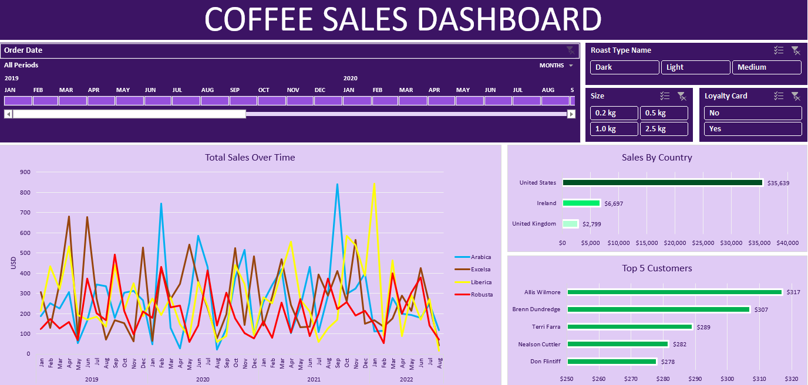

# ☕ Coffee Sales Analytics Dashboard  

##  Overview  
The **Coffee Sales Analytics Dashboard** is a data visualization project developed in Excel to explore and analyze coffee sales data. The main objective was to turn raw data into meaningful insights that could help understand sales patterns and business performance more effectively.  

##  Project Description  
In this project, I worked with a dataset containing coffee sales records and used Excel’s data analysis and visualization features to design an interactive dashboard. The dashboard provides a clear overview of how sales vary across different dimensions such as time, roast type, product size, country, and customer loyalty.  

The idea was to create a tool that doesn’t just display numbers, but tells a story about the business — showing trends, identifying key markets, and highlighting top-performing customers in a way that’s easy to interpret.  

##  Key Features  
- **Sales Trends:** A line chart tracks total sales over time, helping to identify seasonal trends and growth patterns.  
- **Top Customers:** A bar chart highlights the most valuable customers based on total sales, useful for customer relationship strategies.  
- **Top Countries:** A visual breakdown of sales by country reveals which regions contribute the most revenue.  
- **Interactive Filters:** The dashboard allows filtering by roast type, size, and country for deeper exploration.  

##  Project Goals  
- To explore coffee sales data and uncover meaningful insights.  
- To identify the main factors influencing sales performance.  
- To support data-driven decision-making in marketing, pricing, and product strategy.  
- To communicate findings clearly through an interactive and well-designed Excel dashboard.  

##  Tools Used  
- **Microsoft Excel** – used for data cleaning, analysis, visualization, and dashboard creation.  

##  Outcome  
The final dashboard provides a comprehensive and interactive view of coffee sales performance. It highlights key business insights in a visual and accessible format, making it easier for stakeholders to understand patterns, spot opportunities, and make informed decisions.  

Working on this project helped me strengthen my skills in data visualization, analytical thinking, and storytelling with data — all while gaining a deeper appreciation for how meaningful insights can be drawn from everyday business data.  

## 🖼️ Dashboard Preview  

